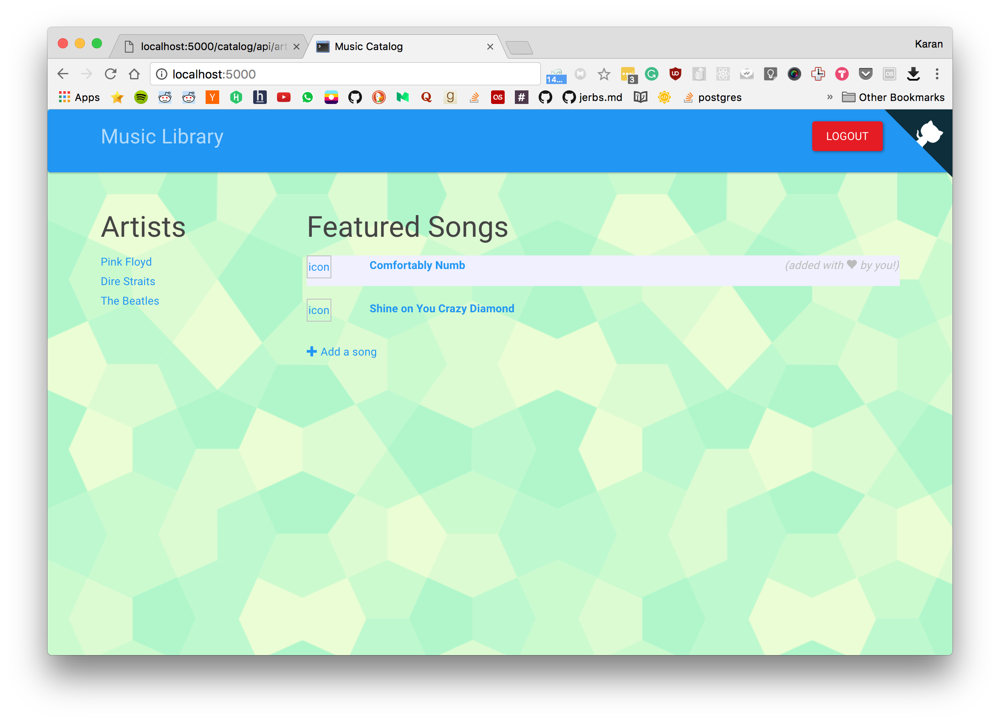
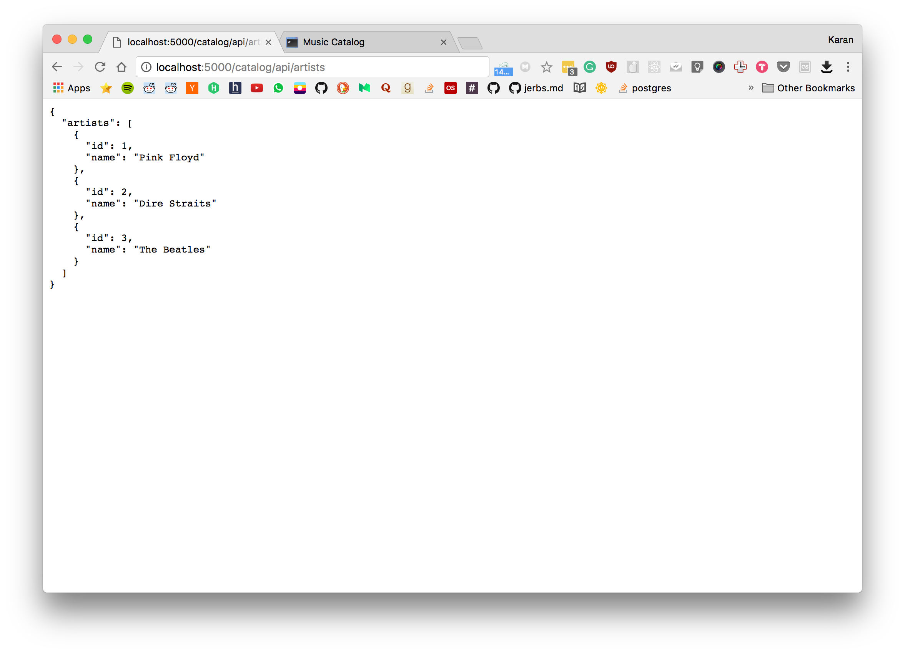

# Project 5 FSND

### Setup Project

```bash
  $ git clone https://github.com/mr-karan/Udacity-FullStack-ND004
  $ cd Udacity-FullStack-ND004/Project5/
  $ virtualenv venv
  $ source venv/bin/activate
  $ pip install -r requirements.txt
```

### Create Database
```bash
   $ psql 
   $ CREATE DATABASE udacity_song;
   $ \q
```

### Running
- (Optional) Obtain your own GitHub API keys by [registering a new application](https://github.com/settings/applications).  Ensure you add `localhost:5000/github-callback` as the authorization callback URL.
- `source export_keys.sh`.
- `python application.py`.
- `localhost:5000`.  The first-time run of the server will initialize the database with sample music data.


### JSON Endpoint is available at

[http://localhost:5000/catalog/api/artists](http://localhost:5000/catalog/api/artists)

### Screenshots
 
 
